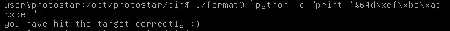
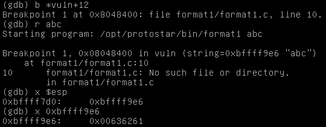
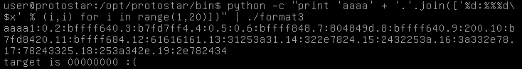

## Format 0

源码：

``` c
#include <stdlib.h>
#include <unistd.h>
#include <stdio.h>
#include <string.h>

void vuln(char *string)
{
  volatile int target;
  char buffer[64];

  target = 0;

  sprintf(buffer, string);
  
  if(target == 0xdeadbeef) {
      printf("you have hit the target correctly :)\n");
  }
}

int main(int argc, char **argv)
{
  vuln(argv[1]);
}
```

此题的基本原理仍然是栈溢出，但是题目中要求输入字符不多于10个，所以就要利用格式化字符串中的**宽度**，覆盖掉`target`的值：



---

## Format 1

源码:

``` c
#include <stdlib.h>
#include <unistd.h>
#include <stdio.h>
#include <string.h>

int target;

void vuln(char *string)
{
  printf(string);
  
  if(target) {
      printf("you have modified the target :)\n");
  }
}

int main(int argc, char **argv)
{
  vuln(argv[1]);
}
```

此题是要利用格式化字符串漏洞来改变全局变量`target`的值，可以利用`%n`这一转换指示符来改写内存的值，但首先要拿到`target`的地址，可以使用`objdump`来查看（未被初始化的全局变量应该在`.bss`段内）：


随后寻找`argv[1]`的缓冲区距离printf函数栈基后参数的的偏移，利用gdb：



我们将断点下在调用`printf`函数之前，`esp`内地址指向的为`printf`的第一个参数——格式化字符串——的地址，即`argv[1]`。我们可以看到`esp`内的值为`0xbffff9e6`，那么有

	(0xbffff9e6-0xbffff7d0) / 4 = 133……2

麻烦的是`argv[1]`的缓冲区首地址并没有4字节对齐。经试验发现，缓冲区的起始地址是与长度有关系的，上述`argv[1]`为`abc`，算上`\0`其长度为4，起始地址为`0xbffff9e6`，若`argv[1]`改为`abcd`，长度为5，则起始地址往前推了一个字节为`0xbffff9e5`。~~猜想程序在将参数放入栈时，结束地址是固定的，所以导致此种情况。~~事实证明猜想错误！

那我们就可以在字符串末尾增添字符，使得缓冲区首地址能够四字节对齐。令`argv[1]`为`\x38\x96\x04\x08aa`，则此时缓冲区首地址位于`0xbffff9e4`，则其引用位置为`%133$x`。

在非gdb环境下，栈的地址又会有所不同，但相对位置的偏差不会很大，在`%133$x`附近搜索一下即可找到。


---

## Format 2

源码：

``` c
#include <stdlib.h>
#include <unistd.h>
#include <stdio.h>
#include <string.h>

int target;

void vuln()
{
  char buffer[512];

  fgets(buffer, sizeof(buffer), stdin);
  printf(buffer);
  
  if(target == 64) {
      printf("you have modified the target :)\n");
  } else {
      printf("target is %d :(\n", target);
  }
}

int main(int argc, char **argv)
{
  vuln();
}
```

这里还是首先寻找缓冲区偏移，因为缓冲区位置不会变，这一过程比上一题要顺利多了。可以看到，缓冲区位于`4$`的位置：


> 此处要说明一下`$`符号转义的问题，shell命令首先会对输入内容进行解析，对于双引号中的`$`符号会当作变量来解析，所以需要转义`\$`；如果用` `` `括起来的话，对于` `` `中的输出结果shell又会再解析一遍，所以要输出`$`就要这样转义`\\\$`。

随后得到`target`变量的地址并覆盖：


---

## Format 3

源码：

``` c
#include <stdlib.h>
#include <unistd.h>
#include <stdio.h>
#include <string.h>

int target;

void printbuffer(char *string)
{
  printf(string);
}

void vuln()
{
  char buffer[512];

  fgets(buffer, sizeof(buffer), stdin);

  printbuffer(buffer);
  
  if(target == 0x01025544) {
      printf("you have modified the target :)\n");
  } else {
      printf("target is %08x :(\n", target);
  }
}

int main(int argc, char **argv)
{
  vuln();
}
```

首先确定`target`变量所在位置：


寻找缓冲区位置偏移：



可以看到位于`12$`的位置。

这一题与上一道题目不同的地方在于我们要将目标变量修改为一个非常大的值，`0x01025544=16930116`，直接采用覆盖一个`int`的方法是不行的，我们可以采取逐个字节覆盖的方法：


---

## Format 4

源码：

``` c
#include <stdlib.h>
#include <unistd.h>
#include <stdio.h>
#include <string.h>

int target;

void hello()
{
  printf("code execution redirected! you win\n");
  _exit(1);
}

void vuln()
{
  char buffer[512];

  fgets(buffer, sizeof(buffer), stdin);

  printf(buffer);

  exit(1);   
}

int main(int argc, char **argv)
{
  vuln();
}
```

此处的想法是修改函数的返回地址为`hello`函数的返回地址，显然此处能利用的就是`printf`函数的返回，否则下述`exit(1)`函数就已经令程序退出了。

查看`hello`函数的地址：


调试core文件，找到`printf`函数的返回地址所在的栈地址。我们可以运行format4程序并输入`%1$n`或者其他的，写入一个不可写的内存使程序在`printf`函数内崩溃，接着我们就可以查看栈来找到其返回值所在的地址：


我们输出`vuln`函数的代码可以知道，`printf`函数所返回的地址应该是`0x08048508`，查看栈，这个值位于地址`0xbffff62c`处，则我们把此地址覆盖为`hello`函数的地址即可：

